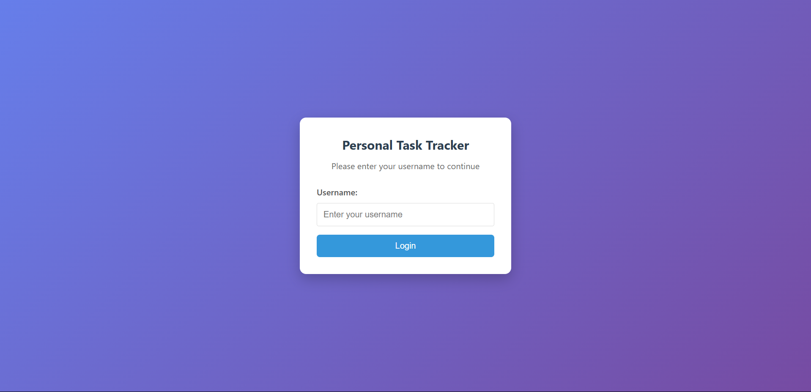
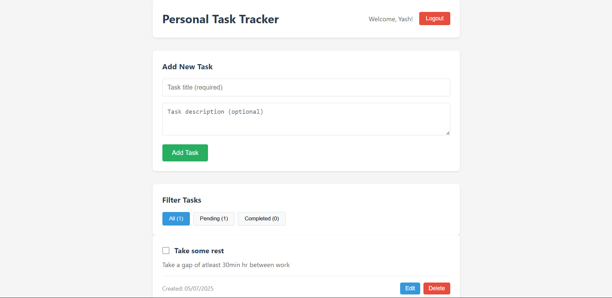

# Personal Task Tracker 📋

A simple, responsive task management application built with React.js that helps users organize and track their daily tasks efficiently.

## 📖 Description

This Personal Task Tracker is a clean, user-friendly application that allows users to manage their tasks with ease. The app features a simple login system, comprehensive task management capabilities, and persistent data storage. Built as a single-page application, it provides a seamless experience across both desktop and mobile devices.

## 🚀 Features

- **Simple Login System**: Basic username-based authentication with localStorage
- **Task Management**: 
  - Add new tasks with title and optional description
  - Edit existing tasks inline or via modal
  - Delete tasks with confirmation prompt
  - Toggle task completion status
- **Task Display**: 
  - View task title, description, and completion status
  - Display creation date/time for each task
  - Visual distinction between completed and pending tasks
- **Smart Filtering**: 
  - Filter tasks by All, Completed, or Pending
  - Task count display for each filter category
- **Data Persistence**: Tasks are saved to localStorage and persist across sessions
- **Responsive Design**: Optimized for both mobile and desktop viewing

## 🛠 Setup Instructions

1. **Clone the repository**
   ```bash
   git clone https://github.com/YashPanwar1408/task-tracker.git
   cd personal-task-tracker
   ```

2. **Install dependencies**
   ```bash
   npm install
   ```

3. **Start the development server**
   ```bash
   npm start
   ```

4. **Open your browser**
   Navigate to [http://localhost:3000](http://localhost:3000) to view the application

## 🧰 Technologies Used

- **React.js** - Frontend framework
- **React Hooks** - State management (useState, useEffect)
- **CSS3** - Styling and responsive design
- **localStorage** - Client-side data persistence
- **HTML5** - Semantic markup

## 🏗 Project Structure

```
task-tracker/
├── public/
│   └── index.html
├── src/
│   ├── components/
│   │   ├── Login.js
│   │   ├── TaskForm.js
│   │   ├── TaskItem.js
│   │   ├── TaskList.js
│   │   └── TaskFilter.js
│   ├── utils/
│   │   └── localStorage.js
│   ├── styles/
│   │   └── App.css
│   ├── App.js
│   └── index.js
├── README.md
└── package.json
```

## 🔗 Live Demo

[View Live Application](https://task-tracker-three-amber.vercel.app/)

## 🖼 Screenshots

### Login page


### Main Dashboard


## 🎯 How to Use

1. **Login**: Enter any username to access the task dashboard
2. **Add Task**: Click "Add Task" button and fill in the title (required) and description (optional)
3. **Manage Tasks**: 
   - Click the checkbox to mark tasks as complete/incomplete
   - Use the edit button to modify task details
   - Click delete to remove tasks (with confirmation)
4. **Filter Tasks**: Use the filter buttons to view All, Completed, or Pending tasks
5. **Persistence**: Your tasks will be saved automatically and available when you return

## 🧪 Sample Data

The application includes sample tasks for testing:

```javascript
const sampleTasks = [
  {
    id: 1,
    title: "Complete React assignment",
    description: "Build a task tracker application",
    completed: false,
    createdAt: "2024-01-15T10:00:00Z"
  },
  {
    id: 2,
    title: "Review JavaScript concepts",
    description: "Go through ES6+ features",
    completed: true,
    createdAt: "2024-01-14T15:30:00Z"
  }
];
```

## 🌟 Bonus Features Implemented

- [ ] Search functionality
- [ ] Task priority levels
- [ ] Due dates for tasks
- [ ] Smooth animations/transitions
- [ ] Dark mode toggle
- [ ] Task categories/tags

**Note**: This application was built as part of an internship assignment to demonstrate React.js skills and frontend development capabilities.